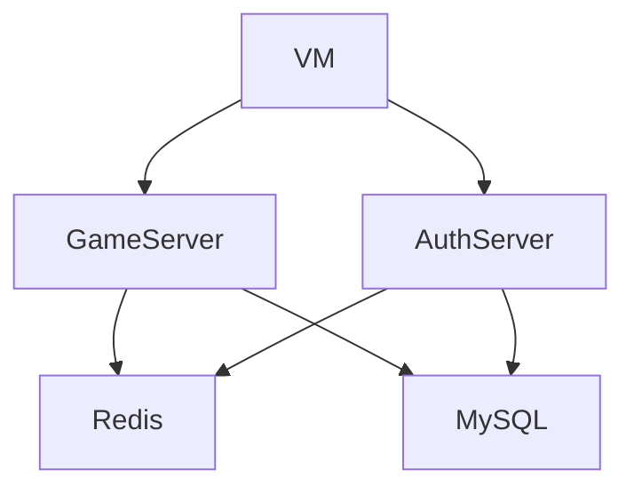

# Developer VM

In case you're developing on a non Windows platform (Linux or Mac) you may need to setup a virtual machine when testing.
You are welcome to use whatever OS you like to develop QC! You have several options to setup a VM, however explaining
how to setup a VM and configuring it correctly is beyond this projects scope. On the other hand we can give you some 
tips.

## Common VM software

* Oracle Virtual Box (free + open source + cross platform - no GPU support)
* Windows Hyper-V (Windows only + at least professional windows required - for GPU dedicated GPU required)
* KVM (Linux only)
* Parallels (MacOS only)

## Good to know

When working with a VM networking is the biggest pain point.

### Correct IP

Depending on your VM setup you may need to use a different IP when connecting with the client and when listening as the
server.

For example _bridged_ networking usually exposes your VM as a "real" machine to your router. Thus the VM gets a
dedicated IP in your local network. The VM then can connect to the host as any other device in your network (usually via
`192.168.x.x`)

A more clean approach would be to use a _host-only_ networking where the VM and the host can only access each other (no 
internet access for the VM). In Virtual Box you will get a dedicated IP for your host: `10.0.0.2` to which you can then
connect to from the VM.

### Firewall

On Windows: When you first launch QuantumCore you will get a firewall popup. If you accept the server may accept
incoming connections. If you decline any attempt will be blocked.

> Please note that this firewall popup will configure _any_ port for the given application (path specific). Thus you 
> will need to do this for the auth and game application.

If you can ping your host from the VM but are unable
to connect with the client be sure to check the hosts firewall. Outgoing connections in the Windows VM aren't blocked by
default.

### Docker

You will most likely use docker to host some required services like Redis or MySQL. This is good. However if you want to
host the auth application in docker too you will have a hard time. As far as we know it's not possible to connect to the
docker containers from the VM.

> If you know better: Please open a PR to update this documentation

The server service dependencies (Redis + MySQL) are not required by the client - the VM does not need to access them.

