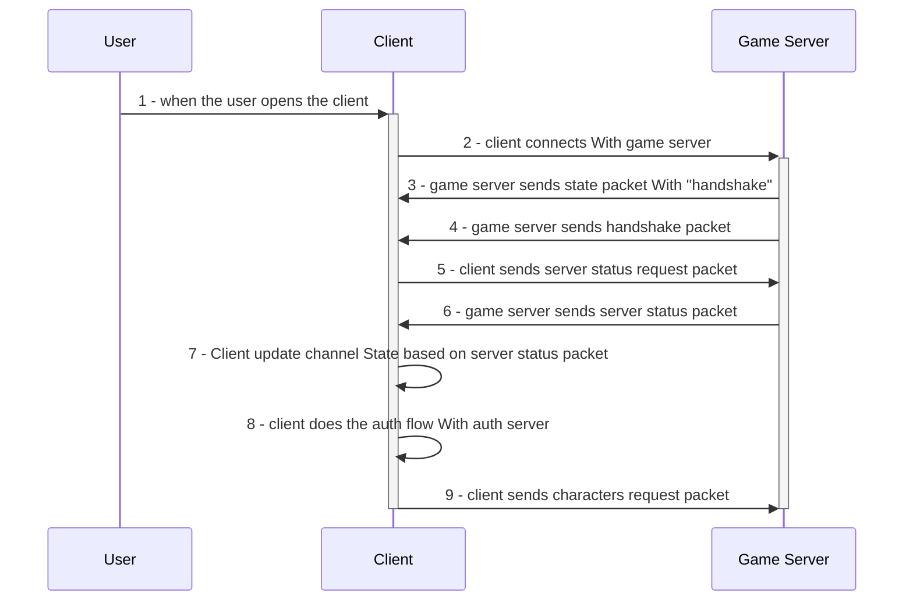
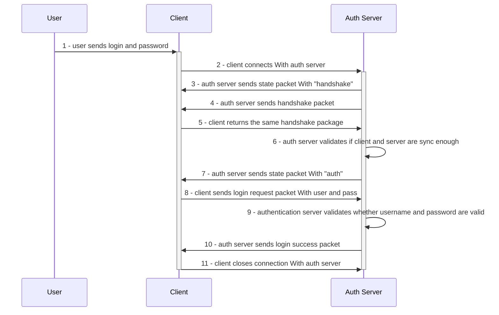

# Process Flows

Describes some of the process flows in metin2. More specifically how client and server interact with each other.

# Fetch Server Infos

```mermaid
sequenceDiagram
    participant U as User
    participant C as Client
    participant S as Game Server
    U->>+C: 1 - when the user opens the client
    C->>+S: 2 - client connects With game server
    S->>C: 3 - game server sends state packet With "handshake"
    S->>C: 4 - game server sends handshake packet
    C->>S: 5 - client sends server status request packet
    S->>C: 6 - game server sends server status packet
    C->>C: 7 - Client update channel State based on server status packet
    C->>C: 8 - client does the auth flow With auth server
    C->>-S: 9 - client sends characters request packet 
    deactivate S
```

# Login

```mermaid
sequenceDiagram
    participant U as User
    participant C as Client
    participant S as Auth Server
    U->>+C: 1 - user sends login and password
    C->>+S: 2 - client connects With auth server
    S->>C: 3 - auth server sends state packet With "handshake"
    S->>C: 4 - auth server sends handshake packet
    C->>S: 5 - client returns the same handshake package
    S->>S: 6 - auth server validates if client and server are sync enough
    S->>C: 7 - auth server sends state packet With "auth"
    C->>S: 8 - client sends login request packet With user and pass
    S->>S: 9 - authentication server validates whether username and password are valid
    S->>C: 10 - auth server sends login success packet
    C->>-S: 11 - client closes connection With auth server
    deactivate S
```
